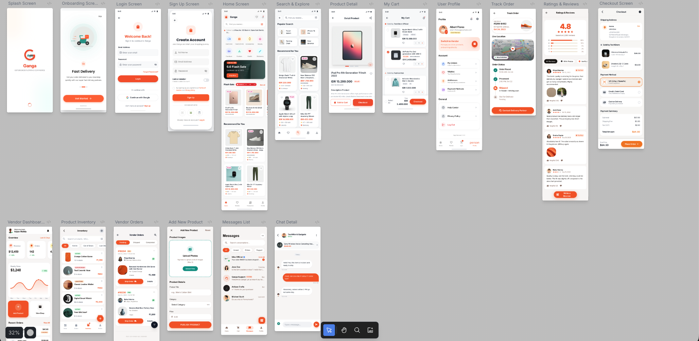
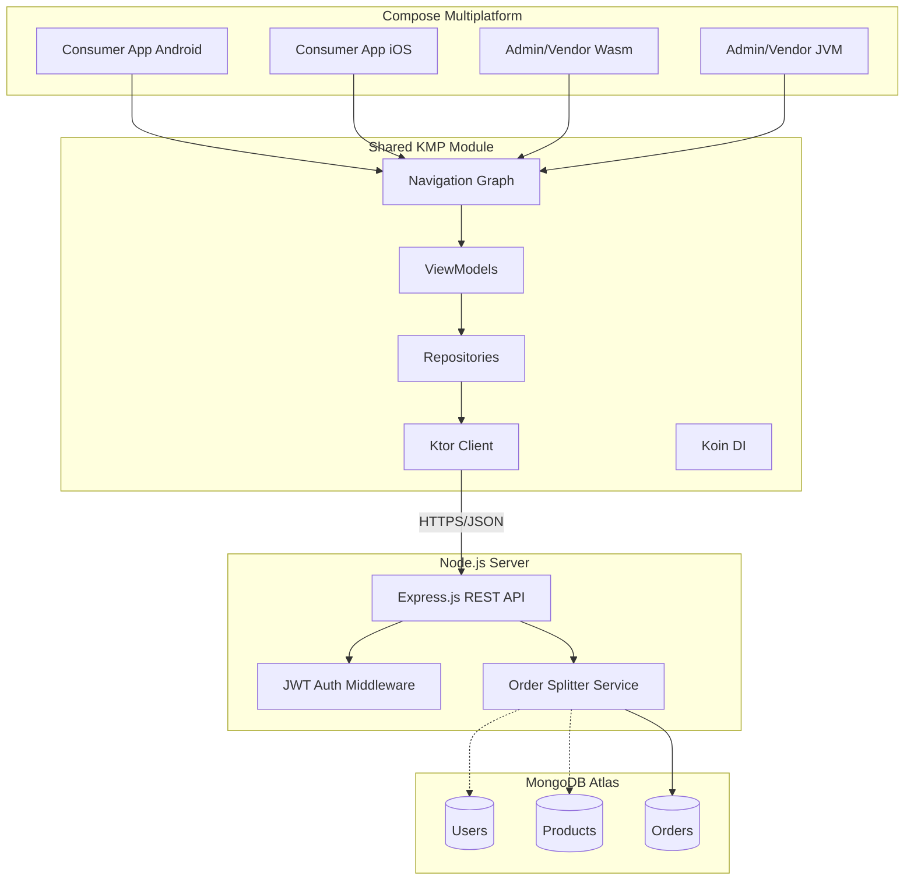

# 🌊 Ganga - Multi-Vendor E-Commerce Ecosystem

<!-- Badges -->


> **A production-grade, full-stack e-commerce engine built to demonstrate System Design, Scalability, and Cross-Platform Code Sharing.**


📱 UI Showcase
--------------

A sneak peek into the **Compose Multiplatform** UI running natively. The interface follows a modern "Luxe" design language with a focus on whitespace and vibrant accents.


> _Screens: Login, Home Dashboard, Product Details, Cart, and Checkout._


🏗️ The Engineering Challenge
-----------------------------

Most e-commerce portfolios build a simple "Nike Store" clone. **Ganga** is different.It is a **Multi-Vendor System** (like Amazon) designed to handle complex business logic:

1.  **Unified Cart:** A user can add items from Vendor A (Electronics) and Vendor B (Clothing) to the same cart.

2.  **Atomic Order Splitting:** The backend intelligently splits one customer payment into multiple sub-orders, ensuring independent inventory tracking and vendor payouts.

3.  **Universal UI:** The entire Frontend (Consumer App + Admin Panel) shares **95% of business logic and UI code** using Kotlin Multiplatform.


🏛 System Architecture
----------------------

The project follows a **Monorepo** structure ensuring Type Safety and Logic consistency.




🚀 Tech Stack
-------------

### **Frontend (Monorepo - /client)**

*   **Framework:** [Kotlin Multiplatform (KMP)](https://kotlinlang.org/lp/multiplatform/)

*   **UI:** [Compose Multiplatform](https://www.jetbrains.com/lp/compose-multiplatform/)

*   **Architecture:** Clean Architecture + MVVM

*   **Navigation:** JetBrains Navigation Compose

*   **Dependency Injection:** Koin

*   **Networking:** Ktor Client 3.0

*   **Database (Local):** Room KMP

*   **Image Loading:** Coil 3.0


### **Backend (Monorepo - /backend)**

*   **Runtime:** Node.js (v20+)

*   **Framework:** Express.js

*   **Database:** MongoDB Atlas (Mongoose ODM)

*   **Security:** JWT (Access + Refresh Token Rotation), Bcrypt

*   **Architecture:** MVC (Model-View-Controller)


🛠️ Setup & Installation
------------------------

### Prerequisites

*   Node.js (v18+)

*   JDK 17 or 21

*   Android Studio (Ladybug or newer)

*   MongoDB Atlas Account


### 1\. Backend Setup (The Brain)

```
# 1. Navigate to backend
cd backend

# 2. Install dependencies
npm install

# 3. Configure Environment
# Create a .env file in /backend with:
# MONGO_URI=your_mongodb_connection_string
# JWT_SECRET=your_secret_key
# PORT=8000

# 4. Run Server
npm run dev
# Output: 🚀 Server running on http://localhost:8000

```

### 2\. Client Setup (The Face)

1.  Open Ganga-Ecommerce/client in **Android Studio**.

2.  Let Gradle Sync finish.

3.  Select composeApp configuration.

4.  Run on **Android Emulator** or **Desktop (JVM)**.


✅ Progress Roadmap
------------------

### Phase 1: Foundation (Completed)

*   \[x\] Monorepo Structure Setup

*   \[x\] Node.js Backend Initialization

*   \[x\] KMP Client Initialization (Android/iOS/Desktop/Web)

*   \[x\] Dependency Injection Setup (Koin)


### Phase 2: Core Backend & Security (Completed)

*   \[x\] MongoDB Atlas Connection

*   \[x\] User & Vendor Schemas

*   \[x\] Auth API (Register/Login) with JWT

*   \[x\] Refresh Token Rotation Strategy


### Phase 3: Consumer App (In Progress)

*   \[x\] Login/Register UI (Compose)

*   \[x\] Home Screen & Product Feed

*   \[x\] Product Search


### Phase 4: Vendor Dashboard

*   \[ \] Product Upload (Desktop)

*   \[ \] Order Management


### Phase 5: The "Complex" Stuff

*   \[x\] Local Cart (Room Database)

*   \[x\] Checkout UI & Logic

*   \[x\] Order Splitting Logic

*   \[ \] Payment Gateway Sandbox

*   \[ \] Push Notifications


🤝 Contributing
---------------

This project is being built in public. If you find a bug or have a suggestion for the KMP architecture, feel free to open an Issue or Pull Request!

📜 License
----------

This project is open-source under the MIT License.


